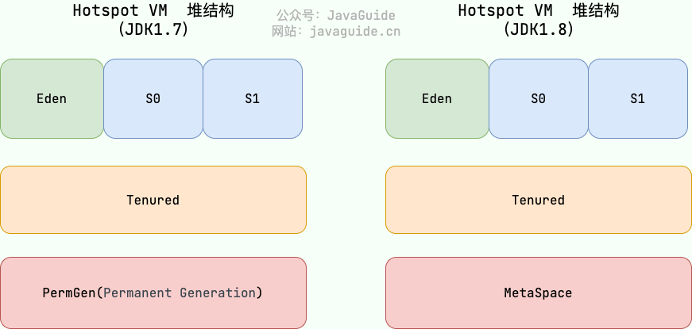

# 类加载

## 类的生命周期

加载 -> 连接 -> 初始化 -> 使用 -> 卸载

### 加载

类加载过程的第一步：

1. 通过全类名获取定义此类的二进制字节流
2. 将字节流解释为方法区的运行时数据结构
3. 在方法区创建一个代表这个类的 java.lang.Class 对象，作为方法区这个类的各种数据的访问入口

加载时通过类加载器来完成，类加载器负责将字节码文件加载到内存中，并生成一个代表这个类的 Class 对象。具体是哪个类加载器来加载这个类的，是由双亲委派模型决定的。

> 双亲委派模型：父类加载器加载不到时，子类加载器才会加载。  
> 由上到下，类加载器为：BootstrapClassLoader(lib 下的 jar) -> ExtClassLoader(lib/ext 下的 jar) -> AppClassLoader(当前应用的 classpath 下的 jar)

> ps:数组类不是通过 ClassLoader 创建的，而是 JVM 在需要的时候自动创建的

### 连接

1. 验证：确保加载的类文件是 Class 文件，并且没有被篡改过
2. 准备：为类变量（而不是实例变量）分配内存并设置默认初始值（0、0L、null、false，而不是自定义的初始值）
3. 解析：将常量池中的符号引用替换为直接引用

### 初始化

初始化阶段是执行初始化方法 &lt;clinit>() 的过程。

# JVM 内存结构


## 堆

存放对象实例，几乎所有的对象实例以及数组都在这里分配内存。

> 从 JDK 1.7 开始已经默认开启逃逸分析，如果某些方法中的对象引用没有被返回或者未被外面使用（也就是未逃逸出去），那么对象可以直接在栈上分配内存

### 堆的划分（主要看 1.8+）



### 新生代（Young Generation）

新生代是所有新对象创建的地方。被分为三个部分 **伊甸园（Eden Memory）**、**survivor 0 区（S0 Memory）**、**survivor 1 区（S1 Memory）**，默认是 8:1:1。

> 新生代触发的是 Minor GC

- 当 Eden 空间被填满时，会触发 Minor GC，Eden 区和其中一个 Survivor 区（假设是 S0）中存活的对象会被复制到另一个 Survivor 区（即 S1）。
- 经过多次 GC 循环后存活下来的对象被移动到老年代
  > Hotspot 遍历所有对象时，按照年龄从小到大对其所占用的大小进行累积，当累积的某个年龄大小超过了 survivor 区的 50% 时（默认值是 50%，可以通过 -XX:TargetSurvivorRatio=percent 来设置，参见 issue1199open in new window ），取这个年龄和 MaxTenuringThreshold 中更小的一个值，作为新的晋升年龄阈值

### 老生代（Old Generation）

老生代包含那些经过许多轮小型 GC 后仍然存活的对象。

> 老生代触发的是 Major GC

- 大对象（需要大量连续内存空间的对象）直接进入老年代

### 元空间（Meta Space，之前叫永久代）

类型信息、字段、方法、常量保存在本地内存（堆外内存）的元空间，但字符串常量池、静态变量仍在堆中

## 虚拟机栈

所有的方法调用都是通过栈来实现的（native 方法除外）

### 栈帧

栈由一个个栈帧组成，而每个栈帧中都拥有：局部变量表、操作数栈、动态链接、方法返回地址。和数据结构上的栈类似，两者都是先进后出的数据结构，只支持出栈和入栈两种操作。

- StackOverFlowError： 若栈的内存大小不允许动态扩展，那么当线程请求栈的深度超过当前 Java 虚拟机栈的最大深度的时候，就抛出 StackOverFlowError 错误。
- OutOfMemoryError： 如果栈的内存大小可以动态扩展， 如果虚拟机在动态扩展栈时无法申请到足够的内存空间，则抛出 OutOfMemoryError 异常。

#### 局部变量表

主要存放了编译期可知的各种数据类型（boolean、byte、char、short、int、float、long、double）、对象引用（reference 类型，它不同于对象本身，可能是一个指向对象起始地址的引用指针，也可能是指向一个代表对象的句柄或其他与此对象相关的位置）

#### 操作数栈

主要作为方法调用的中转站使用，用于存放方法执行过程中产生的中间计算结果。另外，计算过程中产生的临时变量也会放在操作数栈中

#### 动态链接

主要服务一个方法需要调用其他方法的场景。主要作用是链接方法调用时，通过动态链接表来确定被调用方法的具体地址，将符号引用替换为直接引用。

## 本地方法栈

本地方法栈则为虚拟机使用到的 Native 方法服务

> 在 HotSpot 虚拟机中和 Java 虚拟机栈合二为一

## 程序计数器

当前线程所执行的字节码的行号。

> 程序计数器是唯一一个不会出现 OutOfMemoryError 的内存区域，它的生命周期随着线程的创建而创建，随着线程的结束而死亡

# GC

Java 堆是垃圾收集器管理的主要区域，因此也被称作 GC 堆（Garbage Collected Heap）。

## 内存分配和回收原则

- 对象优先在 Eden 区分配，如果 Eden 区没有足够的空间进行分配时，JVM 将发起一次 Minor GC。如果 Eden 中的对象 S0 或 S1 无法存放，则将对象提前转移到老年代。
- 大对象直接存放到老年代。
- 长期存活的对象将进入老年代。

## 主要进行 GC 的区域（针对 HotSpot VM）

Partial GC:

- 新生代收集（Minor GC）: 只针对新生代进行垃圾回收
  > 在发生 Minor GC 之前，进行判断，如果老年代的连续空间大于新生代对象总大小或者历次晋升的平均大小，则进行 Minor GC，否则进行 Full GC
- 老年代收集（Major GC）: 只针对老年代进行垃圾回收
- 混合代收集（Mixed GC）: 对整个新生代和部分老年代进行垃圾回收

Full GC:

- 全量垃圾回收（Full GC）: 对整个堆进行垃圾回收

## 可回收对象判断方法

- 对象可以被回收，不代表立马被回收。
  > 要经历两次标记。第一次标记，判断对象是否有必要执行 **finalize()** 方法, 当对象没有覆盖 **finalize()** 方法或**finalize()** 已被 JVM 调用过时，视为没必要执行。被判定为需要执行的对象将会被放在一个队列中进行第二次标记，除非这个对象与引用链上的任何一个对象建立关联，否则就会被真的回收。

### 引用计数法

给对象中添加一个引用计数器，每当对象被引用时，引用计数器加 1，当引用失效时，计数器减 1，当引用计数器为 0 时，表示对象没有被引用，可以回收。  
缺点：无法解决对象之间循环引用的问题。

### 可达性分析算法

通过 GC Roots 作为起始点进行搜索，能够到达到的对象都是存活的，不可达的对象可被回收。

GC Routs:

- JVM 栈中引用的对象
- 本地方法栈中引用的对象
- 方法区中类静态属性引用的对象
- 方法区中常量引用的对象

### 引用类型

引用分为以下四种，强度依次减弱：

#### 1. 强引用（Strong Reference）

```
Object obj = new Object();
```

被强引用关联的对象不会被回收。

#### 2. 软引用（Soft Reference）

```
Object obj = new Object();
SoftReference<Object> softReference = new SoftReference<>(obj);
obj = null; // 强引用置空，使对象只被软引用关联
```

被软引用关联的对象只有在内存不够的情况下才会被回收。

#### 3. 弱引用（Weak Reference）

```
Object obj = new Object();
WeakReference<Object> wf = new WeakReference<Object>(obj);
obj = null;
```

被弱引用关联的对象一定会被回收，也就是说它只能存活到下一次垃圾回收发生之前。

#### 4. 虚引用（Phantom Reference）

```
Object obj = new Object();
PhantomReference<Object> pf = new PhantomReference<Object>(obj);
obj = null;
```

虚引用并不会决定对象的生命周期。如果一个对象仅持有虚引用，那么它就和没有任何引用一样，在任何时候都可能被垃圾回收。虚引用主要用来跟踪对象被垃圾回收的活动。

### 如何判断一个类是无用的类

- 该类所有的实例都已经被回收，也就是 Java 堆中不存在该类的任何实例。
- 加载该类的 ClassLoader 已经被回收。
- 该类对应的 java.lang.Class 对象没有在任何地方被引用，无法在任何地方通过反射访问该类的方法。

## 垃圾收集算法

### 标记-清除算法

首先标记出所有不需要回收的对象，在标记完成后统一回收掉所有没有被标记的对象。这种方式会带来两个明显的问题：

1. 效率问题：标记和清除两个过程效率都不高（需要扫描两次）
2. 空间问题：标记清除后会产生大量不连续的内存碎片

### 复制算法

将内存分为大小相同的两块，每次使用其中的一块。当这一块的内存使用完后，就将还存活的对象复制到另一块去，然后再把使用的空间一次清理掉。这种方式依然存在以下问题：

1. 可用内存变小：可用内存缩小为原来的一半
2. 不适合老年代：如果存活对象数量比较大，复制性能会变得很差

### 标记-整理算法

与标记-清楚算法的标记过程一样，只是后续步骤，不对可回收对象进行回收，而是直接将存活对象向一端移动，然后清理掉边界以外的内存。

> 由于多了整理这一步，因此效率也不高，适合老年代这种垃圾回收频率不是很高的场景

### 分代收集算法

这种算法没有什么新的思想，只是根据对象存活周期的不同将内存分为几块。一般将 Java 堆分为新生代和老年代，这样我们就可以根据各个年代的特点选择合适的垃圾收集算法。

比如新生代中，每次收集都会有大量对象死去，可以选择“标记-复制算法”。而老年代对象存活几率比较大，必须选择“标记-清除算法”或“标记-整理算法”。

HotSpot 为什么要分为新生代和老年代？

> 对象存活周期不同，分为不同代，选择合适的收集算法

## 垃圾收集器

### Serial 收集器

使用一条线程完成垃圾收集工作，工作时需要“Stop-the-world”。

> 新生代采用标记-复制算法，老年代采用标记-整理算法

### ParNew 收集器

Serial 的多线程版本，使用多线程完成垃圾收集工作。

> 新生代采用标记-复制算法，老年代采用标记-整理算法

### Parallel Scavenge 收集器

其他收集器一般是关注尽可能缩短 “停顿时间”。Parallel Scavenge 关注的时“吞吐量优先”。

默认同时使用 Parallel Old 收集器。

> - 可以通过一个开关参数打开 GC 自适应的调节策略(GC Ergonomics)，JVM 会根据内存使用情况，动态调整新生代和老年代大小。
> - 新生代采用标记-复制算法，老年代采用标记-整理算法

### Serial Old 收集器

Serial 收集器的老年代版本。适合 Client 模式。

### Parallel Old 收集器

是 Parallel Scavenge 收集器的老年代版本。

在注重吞吐量以及 CPU 资源敏感的场合，都可以优先考虑 Parallel Scavenge 加 Parallel Old 收集器。

### CMS 收集器

CMS（Concurrent Mark Sweep）收集器是一种以获取最短回收停顿时间为目标的收集器。它非常符合在注重用户体验的应用上使用。

> 使用“标记-清除算法”

分为以下四个流程:

- 初始标记: 仅仅只是标记一下 GC Roots 能直接关联到的对象，速度很快，需要停顿。
- 并发标记: 进行 GC Roots Tracing 的过程，它在整个回收过程中耗时最长，不需要停顿。
- 重新标记: 为了修正并发标记期间因用户程序继续运作而导致标记产生变动的那一部分对象的标记记录，需要停顿。
- 并发清除: 不需要停顿。

### G1 收集器

G1 (Garbage-First) 是一款面向服务器的垃圾收集器,主要针对配备多颗处理器及大容量内存的机器. 以极高概率满足 GC 停顿时间要求的同时,还具备高吞吐量性能特征。

G1 把堆划分成多个大小相等的独立区域(Region)，新生代和老年代不再物理隔离。通过引入 Region 的概念，从而将原来的一整块内存空间划分成多个的小空间，使得每个小空间可以单独进行垃圾回收。

特点如下：

- 空间整合：与 CMS 的“标记-清除”算法不同，G1 从整体来看是基于“标记-整理”算法实现的收集器；从局部上来看是基于“标记-复制”算法实现的。
- 可预测的停顿：这是 G1 相对于 CMS 的另一个大优势，降低停顿时间是 G1 和 CMS 共同的关注点，但 G1 除了追求低停顿外，还能建立可预测的停顿时间模型，能让使用者明确指定在一个长度为 M 毫秒的时间片段内，消耗在垃圾收集上的时间不得超过 N 毫秒。
