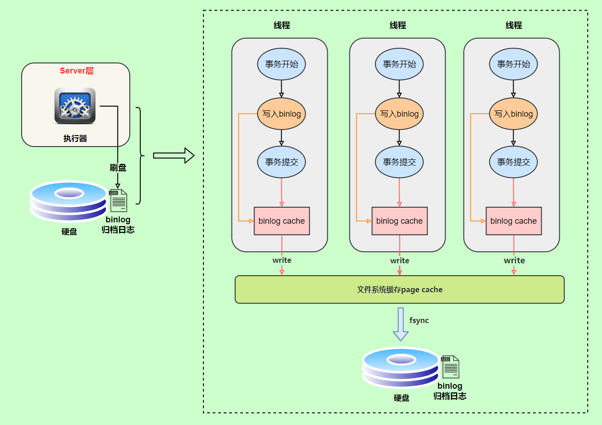
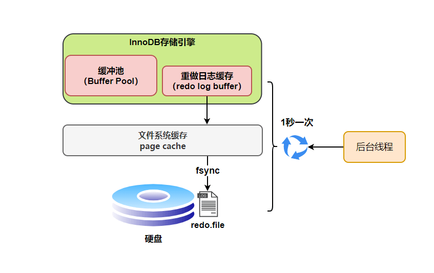

# 执行步骤

- 连接器：身份认证和权限相关
- 分析器：解析 SQL 语句（词法分析、语法分析）
- 优化器：按照 MySQL 认为最优的方案去执行（生成执行计划、选择索引）
- 执行器：调用存储引擎的接口，根据执行计划完成 SQL 的执行
- 存储引擎：数据存储、数据查询

# 索引（主要以 Innodb 为例）

## 索引选型

### Hash 表

Hash 索引不支持顺序和范围查询

### 二叉查找树（BST）

二叉查找树的性能非常依赖于它的平衡程度，这就导致其不适合作为 MySQL 底层索引的数据结构

### AVL（自平衡二叉查找树）

由于 AVL 树需要频繁地进行旋转操作来保持平衡，因此会有较大的计算开销进而降低了数据库写操作的性能。并且， 在使用 AVL 树时，每个树节点仅存储一个数据，而每次进行磁盘 IO 时只能读取一个节点的数据，如果需要查询的数据分布在多个节点上，那么就需要进行多次磁盘 IO。

总结：

1. AVL 写性能不行（由于其要维持自平衡）
2. AVL 读性能不行（每个节点仅存储一个数据）

### 红黑树

红黑树的平衡性较弱，可能会导致树的高度较高，从而影响查询性能。

### B+树

- 叶子节点存储数据，非叶子节点存储索引
- 叶子节点指向下一个叶子节点
- 范围查找对链表进行遍历即可

## 索引种类

1. 主键索引：名为**primary**的唯一非空索引
2. 唯一索引：索引列的值必须是唯一的，但允许为空值
3. 组合索引：在表中的多个字段组合上创建的索引。遵循最左匹配原则
4. 全文索引：只能在 CHAR、VARCHAR、TEXT 类型上创建
5. 普通索引：最基本的索引，没有任何限制

> 1. 聚簇索引：索引结构和数据一起存放的索引（叶子节点存储索引和对应的数据，非单独的索引类型，主键索引就是聚簇索引）
> 2. 非聚簇索引：索引和数据分开存放的索引（叶子节点存储主键，非叶子节点存储索引）
> 3. 索引下推：存储引擎会在使用索引查找时，同时检查非索引字段的值，减少了数据返回，减少回表次数

# 日志

## binlog（归档日志）

bin log 是逻辑日志，记录的是语句的原始逻辑。

bin log 主要用来做数据库的备份、主备、主主、主从。

### 记录格式

- statement
  > 记录 SQL 语句原文
- row
  > 记录 SQL 语句原文，且包含操作的具体数据（如 now()解析成操作时的时间），这种格式看不到详细信息
- mixed
  > 以上两种的混合。判断 SQL 语句是否会引起数据不一致，如果是，使用 row 格式，否则使用 statement 格式

### 写入机制

## redo log（重做日志）

redo log 属于物理日志，记录 Innodb 的事务日志，当数据库挂机了，用来恢复数据。

MySQL 在查询数据时，会把数据加载到 Buffer Pool 中，后续的查询先从 Buffer Pool 中读取，如果 Buffer Pool 中没有，则从磁盘中读取。

更新表数据时，发现 Buffer Pool 中有数据，则直接更新，然后将修改记录到 redo log buffer 中，接着刷盘到 redo log file 中。

### 刷盘时机

1. 事务提交：当事务提交时，会将 redo log buffer 中的数据刷盘到 redo log file 中（设置 innodb_flush_log_at_trx_commit=1）。
2. log buffer 空间不足时：当 log buffer 中缓存的 redo log 达到 log buffer 大约一半时，就需要将日志刷盘。
3. 事务日志缓冲区满：当事务日志缓冲区满时，需要将日志刷盘。
4. Checkpoint: InnoDB 会定期执行 Checkpoint 操作，将内存中的脏页刷新到磁盘上，并且将相应的 redo log 记录也刷盘到磁盘上。
5. 后台刷新线程：InnoDB 会启动一个后台刷新线程，定期（1s）将内存中的脏页刷新到磁盘上，同时将相应的 redo log 记录也刷盘到磁盘上。
6. 正常关闭服务器：MySQL 在关闭服务器时，会先将内存中的脏页刷盘到磁盘上，同时将相应的 redo log 记录也刷盘到磁盘上。

### 刷盘策略

innodb_flush_log_at_trx_commit 有 3 种值，默认为 1。

1. 0：每次事务提交时不刷盘，性能高但不安全。如果 MySQL 崩溃，可能会丢失最近 1s 的数据。
2. 1: 每次事务提交时都刷盘，性能低但最安全。
3. 2：每次事务提交时，只把 log buffer 里的 redo log 内容写入 page cache。性能、安全介于 0 和 1 之间。

InnoDB 有个后台线程，每 1 就会把 redo log buffer 中的内容写到 page cache（文件系统缓存），然后调用 fsync 刷盘。

## undo log（回滚日志）

更新数据时，undo log 会记录原始数据更新前的状态，即一条回滚信息。

## 两阶段提交

redo log 和 bin log 写入的时机不一样，有可能会出现 redo log 和 bin log 不一致的问题（有 redo log 而没有 bin log，或者有 bin log 而没有 redo log）。

解决方案：将 redo log 的写入拆成两个步骤 prepare 和 commit（bin log 写入后，设置 redo log 为 commit 阶段）。

1. 当提交事务时，bin log 写入失败（此时 commit 阶段也失败），此时 只有 redo log 且 redo log 处于 prepare 阶段。当 MySQL 重启时，判断 redo log 不为 commit 阶段且 bin log 不存在，则回滚事务。
2. 当事务提交时，bin log 写入成功，commit 阶段设置失败，此时有 prepare 阶段的 redo log 和 bin log。MySQL 会认为事务是完整的，就会提交事务恢复数据。

# 事务隔离级别

| 隔离级别 | 脏读 | 不可重复度 | 幻读 |
| :------- | :--: | :--------: | :--: |
| 读未提交 |  √   |     √      |  √   |
| 读已提交 |  ×   |     √      |  √   |
| 可重复读 |  ×   |     ×      |  √   |
| 串行化   |  ×   |     ×      |  ×   |

脏读：在事务中读取到别的事务未提交的数据。
不可重复读：在同一个事务中，读取同一条记录，返回两次结果不一致。
幻读：在同一个事务中，两次查询出的数据集不同（侧重其他事务新增/删除数据）。

## 各个隔离级别如何实现的

1. 读未提交

   > 事务读不加锁不阻塞其他事务的读和写
   > 事务写阻塞其他事务写，不阻塞其他事务读

2. 读已提交
   > 每次读都生成一个 ReadView
3. 可重复读
   > 第一次读生成一个 ReadView
4. 串行化
   > 写加写锁，读加读锁

# MVCC

通过在每个数据行上维护多个版本的数据来实现的（undo log 中的版本链）

RC 和 RR 下 MVCC 的差异：

- RC 下，每次 selet 查询前都生成一个 Read View。（m_ids 列表每次都是最新的）
- RR 下，第一次次 selet 查询前生成一个 Read View。（m_ids 列表是固定的，即使列表里的事务已提交，对于这个列表来说，其还是活跃的）

RR 下避免幻读：

1. 执行普通的 select，此时会以 MVCC 快照读的方式读取数据
2. 执行 select...for update、insert、upadte、delete 等时，使用 Next-key Lock 锁定邻键（Gap Lock 锁定间隙，没有命中时，将对应的间隙区间锁定）
