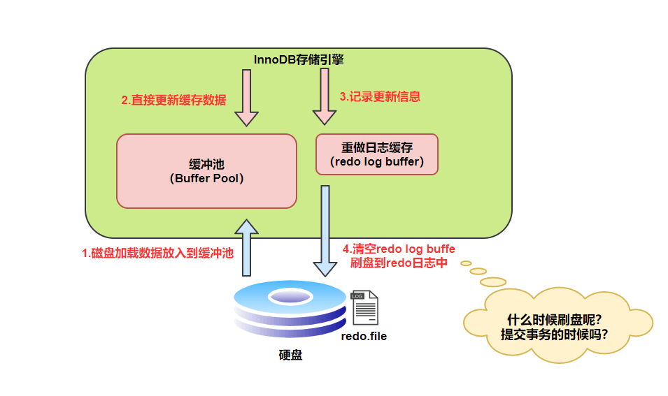

# 执行步骤

- 连接器：身份认证和权限相关
- 分析器：解析 SQL 语句（词法分析、语法分析）
- 优化器：按照 MySQL 认为最优的方案去执行（生成执行计划、选择索引）
- 执行器：调用存储引擎的接口，根据执行计划完成 SQL 的执行
- 存储引擎：数据存储、数据查询

# 索引（主要以 Innodb 为例）

## 索引选型

### Hash 表

Hash 索引不支持顺序和范围查询

### 二叉查找树（BST）

二叉查找树的性能非常依赖于它的平衡程度，这就导致其不适合作为 MySQL 底层索引的数据结构

### AVL（自平衡二叉查找树）

由于 AVL 树需要频繁地进行旋转操作来保持平衡，因此会有较大的计算开销进而降低了数据库写操作的性能。并且， 在使用 AVL 树时，每个树节点仅存储一个数据，而每次进行磁盘 IO 时只能读取一个节点的数据，如果需要查询的数据分布在多个节点上，那么就需要进行多次磁盘 IO。

总结：

1. AVL 写性能不行（由于其要维持自平衡）
2. AVL 读性能不行（每个节点仅存储一个数据）

### 红黑树

红黑树的平衡性较弱，可能会导致树的高度较高，从而影响查询性能。

### B+树

- 叶子节点存储数据，非叶子节点存储索引
- 叶子节点指向下一个叶子节点
- 范围查找对链表进行遍历即可

## 索引种类

1. 主键索引：名为**primary**的唯一非空索引
2. 唯一索引：索引列的值必须是唯一的，但允许为空值
3. 组合索引：在表中的多个字段组合上创建的索引。遵循最左匹配原则
4. 全文索引：只能在 CHAR、VARCHAR、TEXT 类型上创建
5. 普通索引：最基本的索引，没有任何限制

> 1. 聚簇索引：索引结构和数据一起存放的索引（叶子节点存储索引和对应的数据，非单独的索引类型，主键索引就是聚簇索引）
> 2. 非聚簇索引：索引和数据分开存放的索引（叶子节点存储主键，非叶子节点存储索引）
> 3. 索引下推：存储引擎会在使用索引查找时，同时检查非索引字段的值，减少了数据返回，减少回表次数

# 日志

## binlog（归档日志）

## redo log（重做日志）

记录 Innodb 的事务日志，当数据库挂机了，用来恢复数据。

MySQL 在查询数据时，会把数据加载到 Buffer Pool 中，后续的查询先从 Buffer Pool 中读取，如果 Buffer Pool 中没有，则从磁盘中读取。

更新表数据时，发现 Buffer Pool 中有数据，则直接更新，然后将修改记录到 redo log buffer 中，接着刷盘到 redo log file 中。

### 刷盘时机

## undo log（回滚日志）
