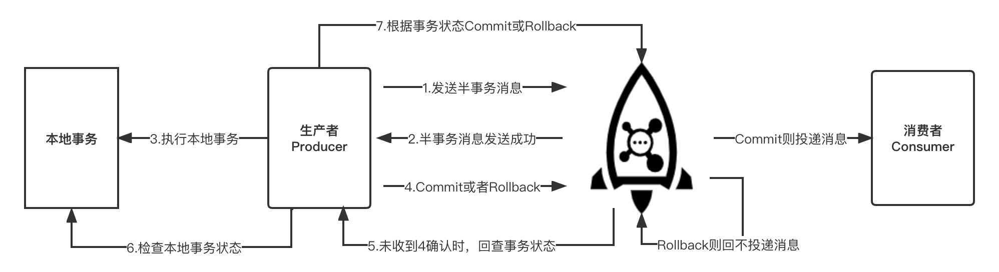

# 架构

## 消息模型

## 部署模型

# 名字服务器 NameServer

一个简单的 Topic 路由注册中心，支持 Topic、Broker 的动态注册与发现。

功能：

- Broker 管理：接收 Broker 集群的注册信息并保存下来作为路由信息的基本数据。提供心跳检测机制，检查 Broker 是否存活。
  > Broker 每隔 30s 向 NameServer 发送心跳，表示自己还存活
  > 若 Broker 120s 内没有发送心跳，NameServer 则认为 Broker 可能已离线或故障，并将其从活跃列表中移除
- 路由信息管理：每个 NameServer 将保存关于 Broker 集群的整个路由信息。

NameServer 通常会部署多个实例，**各实例之间不进行信息通信**

# 代理服务器 Broker

Broker 主要负责消息的存储、投递和查询及服务高可用的保证。

Broker 在进行主从部署时，可以有多个 Master 和其对应的多个 Slave。Master 和 Slave 的对应关系通过指定相同的 BrokerName，不同的 BrokerId 来实现。BrokerId 为 0 表示 Master。

小结：

- 每个 Broker 与 NameServer 集群中的所有节点建立长连接，定时注册 Topic 信息到所有的 NameServer 中。
- Producer 与 NameServer 集群中的一个节点建立长连接，定期从 NameServer 中获取路由信息。并向提供 Topic 服务的 Master 建立长连接，定时发送心跳。
- Consumer 与 NameServer 集群中的一个节点建立长连接，定期从 NameServer 中获取路由信息。并向提供 Topic 服务的 Master、Slave 建立长连接，定时发送心跳。

# 生产者 Producer

发送消息的角色。

## 消息

消息由以下几个部分组成：

- topic：要发送的消息的主题。
- body：消息体。
- properties：消息的属性，包括发送时间、消息类型、消息标签等。
- transactionId：事务消息的 ID。

topic、tag 如何选择：

> 生产环境中不建议在同一个 Topic 内使用多种消息类型，避免运维过程中的风险和错误。

- 用于区分消息类型时，选择 topic 进行区分，如普通消息、事务消息。
- 业务是否管理：没有直接关联的消息，使用 topic 进行区分；同一类型的消息下不同的分类如交易信息下的电器类订单、生鲜类订单，则可以通过 tag 进行区分。
- 消息优先级是否一致：不同优先级的消息，使用 topic 进行区分。
- 消息量级：量级差异大，则选择 topic 进行区分。

### Keys：

每个消息可以在业务层面设置唯一 key 字段，方便消息的定位。

### 队列

队列是对 Topic 进行的分区（水平扩展），一个 Topic 可以有多个队列（默认 8 个），且可能分布在不同的 Broker 上。

## 普通消息

消息发送前要确认目标 Topic 已被创建和初始化（默认自动创建 Topic）。生产环境一般建议主动管理 Topic 的生命周期。

### 消息发送

同步、异步和单向。前两种消息类型是可靠的，无论发送是否成功，都有响应。

1. 同步发送

同步发送是指发送一条消息后，会在收到服务端的同步响应之后才发送下一条消息。消息发送失败会抛异常，需要主动捕获，并做相应的业务处理。

2. 异步发送

异步发送是指发送一条消息后，不等待服务端的响应，直接发送下一条消息。异步发送不会抛出异常，但消息发送失败时，会通过回调函数通知，因此需要实现回调接口（SendCallback）。

3. 单向发送
   单向发送是指，只发送请求，不等待响应。

## 顺序消息

对于一个指定的 Topic，消息的发送、消费，严格按照 FIFO 的顺序进行。RocketMQ 通过一个标准对消息进行分区，以发送到相同的队列中（MessageQueueSelector）进行消费。

生产的顺序性：

即同一时间，只能有一个生产者在发送顺序消息（可通过分布式锁控制）。

## 延迟消息

一共支持 18 个级别的延迟投递。

大量的同一时刻的延时消息，可能导致消息消费的不准时性（Client 消费慢也会）

## 批量消息

RocketMQ 支持将消息批量打包（List&lt;Message>）一起发送，但批量消息的大小不能超过 1M，且消息的 Topic 必须相同。

## 事务消息

步骤：

1. Producer 向 Broker 发送一个 **半事务消息**，此时消息被标记为“暂不能投递”状态。消息发送成功，则执行本地事务。
2. 根据本地事务执行结果，向 Broker 发送一个 **commit** 或 **rollback** 状态。如果因生产端问题导致不能回复状态，Broker 会主动向 Producer 查询该 **半事务消息** 的最终状态（回调）。只有收到 Producer 的二次确认（commit），消息才会被投递到队列。

# 消费者

## 消费者组 Consumer Group

在 **集群消费** 的模式下，同一个消费者组的 Consumer 会轮询消费队列中的消息。

## 负载均衡

在集群模式下，同一消费者组的消费者会分担收到的全量消息。每个消费者消费消息可以通过 **消费策略** 控制。

消费策略：

- 平均分配策略（默认）：平均分配消息到消费者。
- 机房优先分配策略：优先分配消息到同一个机房内的消费者。
- 一致性哈希分配策略：根据消息的 key 值，将消息分配到消费者。

## 消费位点

RocketMQ 的每个队列都会记录自己的最小位点、最大位点。消费组的消费位点，在集群模式下，由客户端提交给服务端保存，在广播模式下，由客户端自己保存。

消息的重复消费：

当消费端发生崩溃或有新的消费者加入群组，就会触发 **重平衡**，重平衡完成后，每个消费者都可能分配到新的队列。此时消费者需要读取该队列的消费位点（消费组的），有可能导致重复消费（当前队列的消费位点，小于之前队列的消费位点）。

## 消息消费模式

### Push

服务端主动推送消息给客户端。优点是 **及时**， 缺点是可能会导致大量消息同时涌入到消费端。

Push 实现的本质也是 Pull+长轮询。Broker 中的 Queue 没有消息时，Broker 不会立即返回，而是把长轮询 hold 起来，当有消息了，或者长轮询阻塞时间到了，再重新处理 PullRequest

### Pull

客户端主动从服务端拉取数据。优点是客户端可以根据自己的消费能力进行消费，但需要控制好拉取的 **频率**，缺点是拉取频繁容易造成服务端和客户端的压力，拉取间隔长又容易造成消费不及时。
