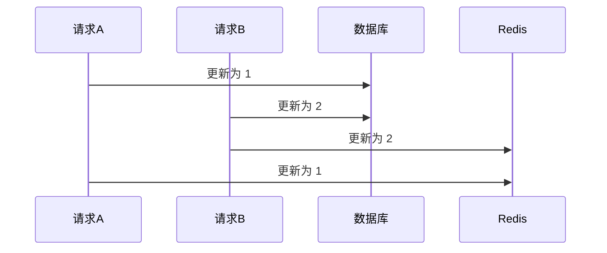
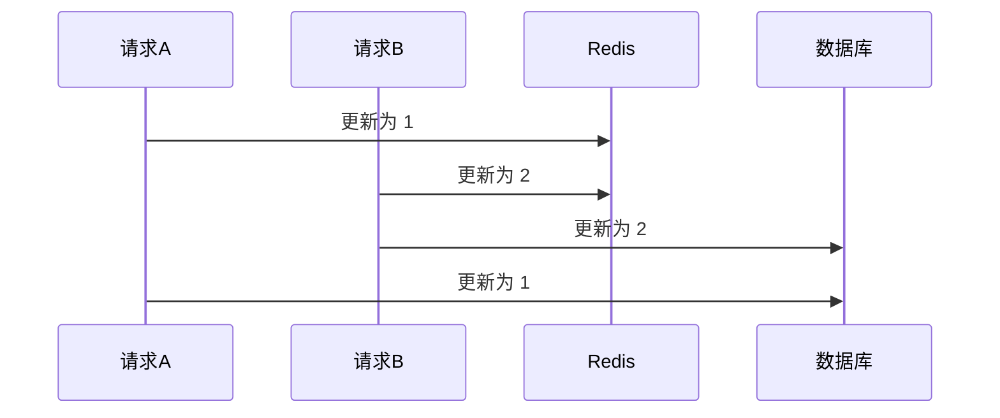

# Redis

## Redis 分片集群

### 分片集群诞生理由

写性能在高并发下会遇到瓶颈&&无法无限地纵向扩展（不划算）

### 分片集群

需要解决「数据路由」和「数据迁移」的问题

### Redis Cluster数据路由

- Redis Cluster默认一个集群有16384个哈希槽，哈希槽会被分配到Redis集群中的实例中
- Redis集群的实例会相互「通讯」，交互自己所负责哈希槽信息（最终每个实例都有完整的映射关系）
- 当客户端请求时，使用CRC16算法算出Hash值并模以16384，自然就能得到哈希槽进而得到所对应的Redis实例位置

### 为什么16384个哈希槽

16384(2KB)个既能让Redis实例分配到的数据相对均匀，又不会影响Redis实例之间交互槽信息产生严重的网络性能开销问题

### Redis Cluster 为什么使用哈希槽，而非一致性哈希算法

哈希槽实现相对简单高效，每次扩缩容只需要动对应Solt（槽）的数据，一般不会动整个Redis实例

## Redis 与 DB 的数据一致性

### 只读缓存

> 查询时插入缓存，更新时删除缓存

#### 方案

1. 先删除缓存，再写数据库
2. 延迟双删（先删除缓存，再写数据库，再延迟删除缓存）
3. 先写数据库，再删除缓存
4. 先写数据库，通过 Binlog，异步删除缓存

#### 结论

方案 1 的问题在于：

    1. 在删除缓存到更新数据库的过程之间，别的线程读取数据，会将旧值写入缓存

方案 2 的问题在于：

    1. 延迟时间要大于「主从复制」的延迟时间
    2. 延迟时间要大于其他线程读取数据库 + 写入缓存的时间

方案 3 要保证删除缓存的成功，需要进行 “重试“，可通过消息队列保证删除成功  
方案 4 需要借助 Binlog 订阅中间件

因此，一般建议采用方案 3 或方案 4

### 读写缓存

> 更新时更新缓存

#### 方案

1. 先写数据库，再写缓存
2. 先写缓存，再写数据库

#### 结论

无论是先写数据库再写缓存，还是先写缓存再写数据库，都会存在并发情况下的不一致问题。

先写数据库，再写缓存：

先写缓存，再写数据库：

