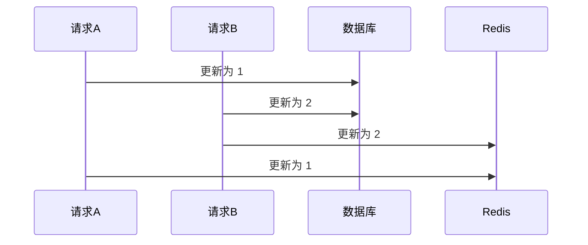
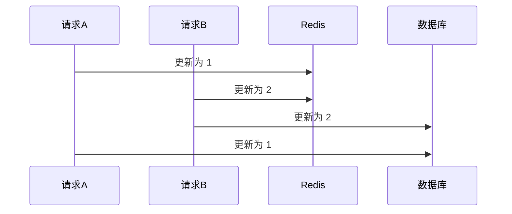

# Redis

## 5 种基本数据类型

### String

底层数据结构：简单动态字符串（SDS）
二进制安全，保存了数据的长度（不依赖/n 判断字符是否到了结尾）

### List

底层数据结构：LinkedList/ZipList/QuickList

### Hash

底层数据结构：Dict、ZipList

### Set

底层数据结构：Dict、IntSet

### ZSet

底层数据结构：ZipList、SkipList

当 Zset 存储的元素数量小于一个值且所有元素的最大长度小于一个值，使用 ZipList（修改数据时，可能需要对整个压缩列表进行重写，性能较差），否则使用
SkipList（查询较快，占用内存较多）

## 3 种特殊类型

### BitMap

每一个 offset 可以存储 0/1，即两个状态的存储可以用 BitMap（点赞、签到、活跃）

### HyperLogLog

基数统计，通过一定的概率统计方法预估数值（登录数、访问量、UV）

### Geo

地理位置

## 持久化

### RDB

根据配置文件（多久有多少个 key 发生变化），创建快照，获取数据在 **某个时间点** 上的副本，一般是 **bgsave** 线程来进行。

优点：

- 大型数据恢复时速度快
- 不影响主进程的读写

缺点：

- 实时性不够
- fork 子进程属于重量级操作，执行成本高
- 版本兼容问题

### AOF

AOF 是写后日志。
优点：

- 避免额外的检查开销。
- 不会阻塞当前的写操作。

缺点：

- 如果命令执行完，写日志之前宕机了，会丢失数据
- 阻塞后续操作

#### 实现方式

1. 命令追加：所有写命令追加到 AOF 缓冲区
2. 文件写入：AOF 缓冲区数据写入到 AOF 文件中（仅 write 到 page cache）
3. 文件同步：根据持久化策略，调用 fsync 将数据同步到硬盘
4. 文件重写：随着 AOF 越来越大，需要定期对 AOF 文件进行重写，达到压缩目的
5. 重启加载：Redis 重启时，可以加载 AOF 文件进行数据恢复

#### fsync 策略

1. appendfsync always：主线程执行 write 操作后，后台线程 aof_fsync 立即调用 fsync 函数同步文件刷盘
2. appendfsync everysec：主线程执行 write 操作后，后台线程 aof_fsync 每隔 1 秒调用 fsync 函数同步文件刷盘
3. appendfsync no：主线程执行 write 操作后立即返回，让操作系统决定何时进行同步

<!-- > 参数：
>
> 1. no-appendfsync-on-rewrite： -->

#### AOF 重写

当 AOF 文件体积超过一定值时（设置的文件大小阈值、比值），fork 一个子进程去进行重写。

重写期间，服务的写命令，记录于 AOF 重写缓冲区

## Redis 主从

作用：

- 数据备份
- 故障恢复
- 负载均衡

复制原理：

- 全量复制：第一次同步，通过 RDB 文）
- 增量同步：主从网络断连期间主库收到的命令，但如果断连太久导致主库 repl_backlog_buffer 被覆盖了，则只能进行全量复制。每个从节点维护了自己复制进度。

主从中的问题：

- 延迟与不一致问题
- 数据过期问题
- 故障切换问题（哨兵模式解决）

## Redis 哨兵机制

哨兵实现的功能：

- 监控：检查主从节点是否正常运行
- 自动故障转移
- 配置提供者：客户端初始化时，通过哨兵获取主节点地址
- 通知：故障转移通知给客户端

## Redis 分片集群

### 分片集群诞生理由

写性能在高并发下会遇到瓶颈&&无法无限地纵向扩展（不划算）

### 分片集群

需要解决「数据路由」和「数据迁移」的问题

### Redis Cluster 数据路由

- Redis Cluster 默认一个集群有 16384 个哈希槽，哈希槽会被分配到 Redis 集群中的实例中
- Redis 集群的实例会相互「通讯」，交互自己所负责哈希槽信息（最终每个实例都有完整的映射关系）
- 当客户端请求时，使用 CRC16 算法算出 Hash 值并模以 16384，自然就能得到哈希槽进而得到所对应的 Redis 实例位置

### 为什么 16384 个哈希槽

16384(2KB)个既能让 Redis 实例分配到的数据相对均匀，又不会影响 Redis 实例之间交互槽信息产生严重的网络性能开销问题

### Redis Cluster 为什么使用哈希槽，而非一致性哈希算法

哈希槽实现相对简单高效，每次扩缩容只需要动对应 Solt（槽）的数据，一般不会动整个 Redis 实例

## Redis 与 DB 的数据一致性

### 只读缓存

> 查询时插入缓存，更新时删除缓存

#### 方案

1. 先删除缓存，再写数据库
2. 延迟双删（先删除缓存，再写数据库，再延迟删除缓存）
3. 先写数据库，再删除缓存
4. 先写数据库，通过 Binlog，异步删除缓存

#### 结论

方案 1 的问题在于：

    1. 在删除缓存到更新数据库的过程之间，别的线程读取数据，会将旧值写入缓存

方案 2 的问题在于：

    1. 延迟时间要大于「主从复制」的延迟时间
    2. 延迟时间要大于其他线程读取数据库 + 写入缓存的时间

方案 3 要保证删除缓存的成功，需要进行 “重试“，可通过消息队列保证删除成功  
方案 4 需要借助 Binlog 订阅中间件

因此，一般建议采用方案 3 或方案 4

### 读写缓存

> 更新时更新缓存

#### 方案

1. 先写数据库，再写缓存
2. 先写缓存，再写数据库

#### 结论

无论是先写数据库再写缓存，还是先写缓存再写数据库，都会存在并发情况下的不一致问题。

先写数据库，再写缓存：

先写缓存，再写数据库：

# Redisson

## 加锁方式

通过lua脚本进行加锁，而不是setNx
1. redis.call('exists', lockName) 判断锁是否存在
2. 不存在的话，hincreby lockName RedissonClientId 1，对当前锁进行加1，并设置过期时间（默认30s）
3. 存在的话，判断当前锁的RedissonClientId是否和当前线程的RedissonClientId一致，一致的话，对当前锁进行加1（可重入），并设置过期时间（默认30s）

## 自动延时
通过看门狗机制（看门狗位于客户端，客户端故障，则不会自动延时了），通过类似上述3的步骤延时