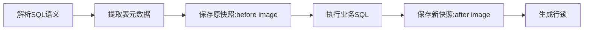

# 分布式事务

## seata

- TC(Transaction Coordinator): 事务协调者。管理全局的分支事务的状态，用于全局性事务的提交和回滚。
- TM(Transaction Manager): 事务管理者。用于开启、提交或回滚事务（@GlobalTransaction）。
- RM(Resource Manager): 资源管理器。用于分支事务上的资源管理，向 TC 注册分支事务，上报分支事务的状态，接收 TC 的命令来提交或回滚分支事务。

### AT 模式

AT 模式的特点是对业务无侵入式，整体机制为二阶段提交（2PC）

- 一阶段: 业务数据和回滚日志记录在同一个本地事务分支，释放本地锁和连接资源。
- 二阶段:
  - 提交异步化，非常快速地完成
  - 通过一阶段的回滚日志进行反向补偿

#### 分布式过程：

- TM 向 TC 申请开启一个全局事务，全局事务创建成功并生成一个全局唯一的 XID；
- XID 在微服务调用链路的上下文中传播；
- RM 向 TC 注册分支事务，将其纳入 XID 对应的全局事务的管辖；
- TM 向 TC 发起针对 XID 的全局提交或回滚决议；
- TC 调度 XID 下的全部分支事务完成提交或回滚。

#### 一阶段步骤：



- 元数据：SQL 类型（UPDATE\DELETE 等）、表名、条件等
- before image：根据解析得到的条件信息，生成查询语句，定位一条数据
- after image：执行业务 SQL 后，根据前镜像主键查询出后镜像数据
- undo_log：业务数据更新前后的镜像组织成回滚日志

##### 二阶段步骤：

1. 正常：
    ```mermaid
    graph LR
        a[TC 提交请求] --> b[异步队列]
        b --> c[查找回滚日志:branchId]
        c --> d[删除回滚日志]
        d --> 释放行锁
    ```

2. 异常：

    ```mermaid
    graph LR
        a[TC 回滚请求] --> b[异步队列]
        b --> c[查找undolog]
        c --> d[脏写校验]
        d --> e[反解析undulog]
        e --> f[执行sql]
        f --> g[删除undolog]
        g --> 释放行锁
    ```

#### 脏写

当发生回滚时，会根据 undolog 检测，已提交的分支事务的当前数据是否和 after image 一致，如果不一致，说明被其他业务更改，会导致脏写检测失败，此时需要人工干预。

> 其他业务可能只是个本地事务，如下单扣库存的场景里，下单和扣库存组成了一个全局分布式事务，但是增加库存的业务本身只是个本地业务。

#### 避免脏写

1.  其他业务也使用全局事务
    > 全局事务需要获取全局锁，当获取不到全局锁时，会抛出 LockConflictException
2.  其他业务使用全局锁
    > 1. 全局锁只会检查全局锁是否已被占用，不会进入全局事务。
    > 2. 配合 select for update 使用，如果没有 select for update，获取不到全局锁的情况下，会直接失败，否则会针对
         LockConflictException 进行重试， 先回滚、释放本地锁、尝试重新争取本地锁（也许获取不到锁后，间隔很短的时间内全局锁就释放了）
    > 3. 释放本地锁的原因是，全局事务的分支事务回滚时，需要本地锁，避免长时间等待。

### TCC 模式