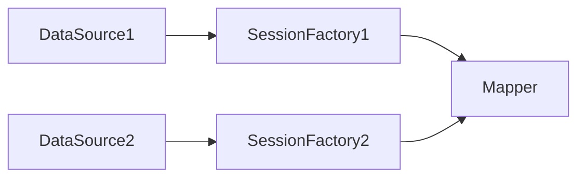
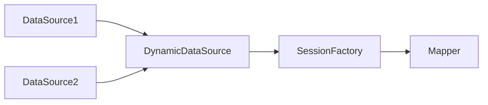

### 实现方式

#### 1. 配置多个 SqlSessionFactory 实现多数据源



> 在 @MapperScan 中指定 sqlSessionFactoryRef

1. 可以结合 JTA 实现分布式事务
2. 整个流程实现相对复杂，且每个库都需要对应一个配置类。

##### 集成

- 依赖

```xml
<!--  注意，这里使用了 mybatis-plus  -->
<dependency>
    <groupId>com.baomidou</groupId>
    <artifactId>mybatis-plus-boot-starter</artifactId>
    <version>xxx</version>
</dependency>
```

- 配置数据源（yaml）

```yaml
spring:
  datasource:
    ds1:
      jdbc-url: jdbc:mysql://ip:port/db?serverTimezone=UTC&useUnicode=true&characterEncoding=utf8&useSSL=false&allowPublicKeyRetrieval=true
      username: root
      password: password
      driver-class-name: com.mysql.cj.jdbc.Driver # 这个目前不是必须的
    ds2:
      jdbc-url: jdbc:mysql://ip:port/db?serverTimezone=UTC&useUnicode=true&characterEncoding=utf8&useSSL=false&allowPublicKeyRetrieval=true
      username: root
      password: password
```

- 配置数据源（configuration）

```java
@Configuration
public class DataSourceConfigurations {

    @Configuration
    @MapperScan(basePackages = "your data source 1 mapper package",
            sqlSessionFactoryRef = "ds1SqlSessionFactory")
    public static class Ds1Configuration {
        public static final String DS1_MAPPER_LOCATION = "classpath*:mapper/ds1/*.xml";


        @Primary
        @Bean("ds1DataSource")
        @ConfigurationProperties(prefix = "spring.datasource.ds1")
        public DataSource ds1DataSource() {
            return DataSourceBuilder.create().build();
        }

        @Primary
        @Bean("ds1TransactionManager")
        public PlatformTransactionManager ds1TransactionManager(@Qualifier("ds1DataSource") DataSource dataSource) {
            return new DataSourceTransactionManager(dataSource);
        }

        @Primary
        @Bean(name = "ds1SqlSessionFactory")
        public SqlSessionFactory ds1SqlSessionFactory(@Qualifier("ds1DataSource") DataSource dataSource) throws Exception {
            // 由于使用的是 mybatis-plus，这里的要使用 mybatis-plus 的 MybatisSqlSessionFactoryBean 来生成 SqlSessionFactory
            MybatisSqlSessionFactoryBean sessionFactoryBean = new MybatisSqlSessionFactoryBean();
            sessionFactoryBean.setDataSource(dataSource);
            sessionFactoryBean.setMapperLocations(new PathMatchingResourcePatternResolver().getResources(DS1_MAPPER_LOCATION));
            return sessionFactoryBean.getObject();
        }
    }

    @Configuration
    @MapperScan(basePackages = "your data source 2 mapper package",
            sqlSessionFactoryRef = "ds2SqlSessionFactory")
    public static class Ds2Configuration {
        public static final String DS2_MAPPER_LOCATION = "classpath*:mapper/ds2/*.xml";

        @Bean
        @ConfigurationProperties(prefix = "spring.datasource.ds2")
        public DataSource ds2DataSource() {
            return DataSourceBuilder.create().build();
        }

        @Bean
        public PlatformTransactionManager ds2TransactionManager(@Qualifier("ds2DataSource") DataSource dataSource) {
            return new DataSourceTransactionManager(dataSource);
        }

        @Bean(name = "ds2SqlSessionFactory")
        public SqlSessionFactory ds2SqlSessionFactory(@Qualifier("ds2DataSource") DataSource dataSource) throws Exception {
            MybatisSqlSessionFactoryBean sessionFactoryBean = new MybatisSqlSessionFactoryBean();
            sessionFactoryBean.setDataSource(dataSource);
            sessionFactoryBean.setMapperLocations(new PathMatchingResourcePatternResolver().getResources(DS2_MAPPER_LOCATION));
            return sessionFactoryBean.getObject();
        }

    }
}
```

事务问题：  
多数据源在直接使用 Spring 的 @Transactional 注解的情况下，无法保证事务的一致性，如果没指定 transactionManager ,则会使用默认的，即 "ds1TransactionManager"。

测试如下：

1. 新建两个数据源 ds1、ds2, 分别创建一个表 tb_test1。
2. 按上述步骤配置好数据源配置与编写好对应的 mapper。
3. 测试程序如下：

```java
    @Override
    @Transactional(rollbackFor = RuntimeException.class)
    public void save() {
        Test1DO test1DO = new Test1DO();
        test1DO.setId(1);
        test1DO.setName("test ds2");
        test1DO.setStatus((short) 1);
        ds1Test1Mapper.insert(test1DO);
        ds2Test1Mapper.insert(test1DO);
    }
```

4. 结果如下：

> 1. 如果此时 ds1 的表里不存在 id 为 1 的数据，而 ds2 存在，则 ds1、ds2 都不会插入数据（看似有事务，但实际是因为 ds2 插入导致 ds1 的事务报错，从而触发了 ds1 的回滚。）
> 2. 如果此时 将 ds1Test1Mapper.insert(test1DO); 和 ds2Test1Mapper.insert(test1DO); 交换位置，同时 ds1 表里存在 id 为 1 的数据而 ds2 不存在，那么 ds2 则会插入成功。

#### 2. 基于 Spring 提供的 AbstractRoutingDataSource，实现动态切换数据源



1. 无法实现全局分布式事务

#### 使用数据库代理中间件
