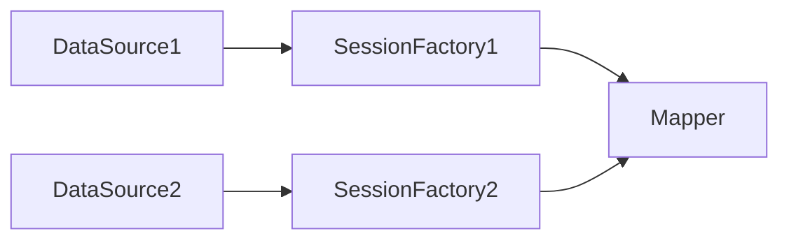
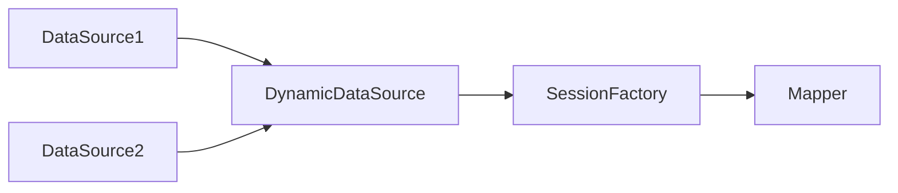

### 实现方式

#### 配置多个 SqlSessionFactory 实现多数据源

```mermaid
graph LR;
DataSource1 --> SessionFactory1;
SessionFactory1 --> Mapper;
DataSource2 --> SessionFactory2;
SessionFactory2 --> Mapper;
```

> 在 @MapperScan 中指定 sqlSessionFactoryRef

不足：每个库都需要对应一个配置类。

#### 基于 Spring 提供的 AbstractRoutingDataSource，实现动态切换数据源

```mermaid
graph LR;
DataSource1 --> DynamicDataSource;
DataSource2 --> DynamicDataSource;

DynamicDataSource --> SessionFactory;
SessionFactory --> Mapper;

```
